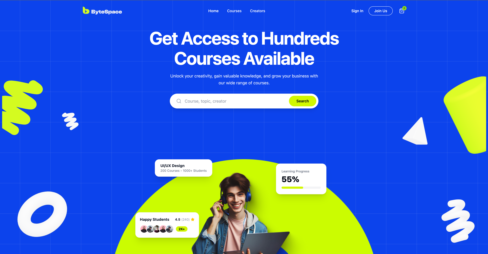

# ByteSpace - Online Learning Platform

A modern, responsive, and pixel-perfect landing page for **ByteSpace**, an online learning platform built with React, TypeScript, and Tailwind CSS based on the Figma design specifications.



## Live Demo

- **Deployed URL**: [https://doin-tech-task.netlify.app](https://doin-tech-task.netlify.app)
- **Sign In Page**: [https://doin-tech-task.netlify.app/#signin](https://doin-tech-task.netlify.app/#signin)
- **Sign Up Page**: [https://doin-tech-task.netlify.app/#signup](https://doin-tech-task.netlify.app/#signup)

---

## Tech Stack

- **Framework**: [React 19](https://react.dev/) + [TypeScript](https://www.typescriptlang.org/)
- **Bundler & Build Tool**: [Vite](https://vite.dev/)
- **Styling**: [Tailwind CSS v4](https://tailwindcss.com/)
- **Icons**: [Lucide React](https://lucide.dev/)
- **Deployment**: [Netlify](https://www.netlify.com/)

---

## Features & Implemented Sections

1. **Navigation Bar**: Responsive header with ByteSpace branding, navigation links, and direct access to Sign In and Sign Up.
2. **Hero Section**:
   - Hero headline, subtitle, and search bar with lime search action.
   - Male student figure with lime arch background.
   - Floating milestone cards (_UI/UX Design_, _Learning Progress_, _Happy Students_) anchored closely to the student figure.
   - 3D decorative shapes (lime & white scribbles, 3D donut, trapezium, and pyramids).
3. **Partner Logos**: High-fidelity brand representations with 200px dedicated height and subtle background styling.
4. **Discover Courses**:
   - Dynamic category filter pills (_All Programme_, _UI/UX Design_, _Programmer_, _Digital Marketing_, _Finance_).
   - 6 detailed course cards with lesson metadata, ratings, student stack badges, and lifetime pricing.
5. **Explore Paths**: 6 category cards (_Design_, _Development_, _IT_, _Business_, _Marketing_, _Photography_) with custom illustrations.
6. **Growth & Creator Showcase**:
   - Ambient multi-stop radial gradient background.
   - Layered student with Figma course card and learning progress.
   - Top instructor showcase with revenue badges and happy student social proof.
7. **Creator Call to Action**: 480px height banner with hero grid pattern, 3D floating shapes, and _"Join as Creator"_ action.
8. **Community Testimonials**: 784px height ambient gradient section featuring verified student feedback cards.
9. **Footer**: 525px height footer with newsletter signup, lime search pill, 3-column navigation directory, and copyright bar.
10. **Auth Pages (Extra Credit)**:
    - **Sign Up (`/#signup`)**: Dedicated registration view with custom visual stage, lime 3D donut with elevated z-index, matching course cards, and account creation form.
    - **Sign In (`/#signin`)**: Dedicated authentication view with matching visual stage, email & password inputs, lime sign-in button, and Google & Facebook social auth buttons.

---

## Getting Started

### Prerequisites

- Node.js (v18 or higher recommended)
- npm or yarn

### Installation

```bash
# Clone the repository
git clone https://github.com/ranak8811/Doin-Tech-Task.git

# Navigate into the project directory
cd Doin-Tech-Task

# Install dependencies
npm install
```

### Development

```bash
# Start local development server
npm run dev
```

### Production Build

```bash
# Run TypeScript check and build production bundle
npm run build

# Preview production build locally
npm run preview
```

---

## Notes for the Reviewer

- **Pixel-Perfect Alignment**: All sections, paddings, typography scale, colors (such as `#0c43ec`, `#D2F801`, and `#f4f5f7`), and 3D decorative placements were meticulously crafted to match the Figma mockups.
- **Color Filter Effects**: White 3D shapes are dynamically tinted to brand lime (`#D2F801`) using lightweight, zero-dependency SVG `<feColorMatrix>` filters.
- **Modular Component Architecture**: Components are strictly organized by feature directory (`navbar`, `hero`, `courses`, `paths`, `growth`, `creator`, `community`, `footer`, `auth`).
- **Lightweight Hash-Based Routing**: Clean URL hash routing (`/#signup`, `/#signin`) enables direct linking and instant transition between landing page and auth views without additional router overhead.
- **Clean Code Standard**: Code has been written by following clean React & TypeScript best practices.
